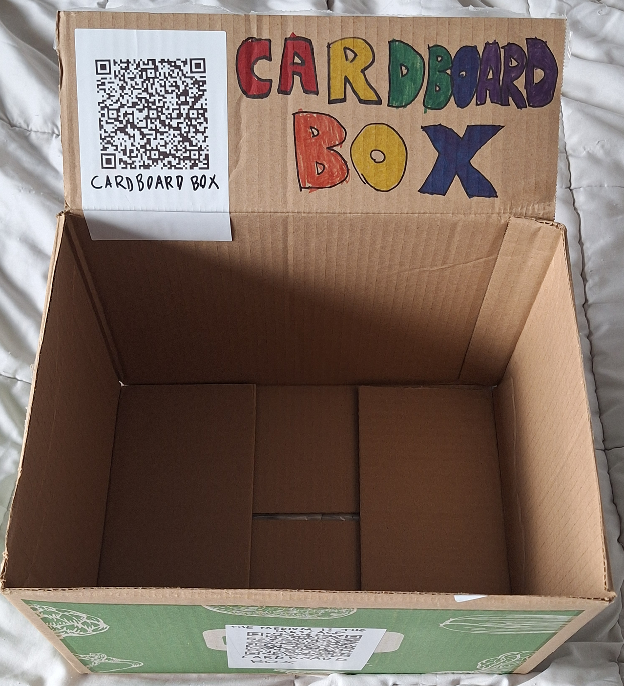

# [library](https://github.com/lafelabs/library/)
# [index.html](index.html)
# [library.json](library.json)
# [thing.json](thing.json)

  
  
# [CARDBOARD BOX!](https://github.com/LafeLabs/library/tree/main/library-of-trash/cardboard-box/)
    
THIS IS A VIRTUAL REPRESENTATION OF THE CARDBOARD BOX!

## [LIVE INSTANCE OF TRASH MAGIC WALL FOR CARDBOARD BOX](https://trashrobot.net/wall/library/library-of-trash/cardboard-box/)

  
  
  