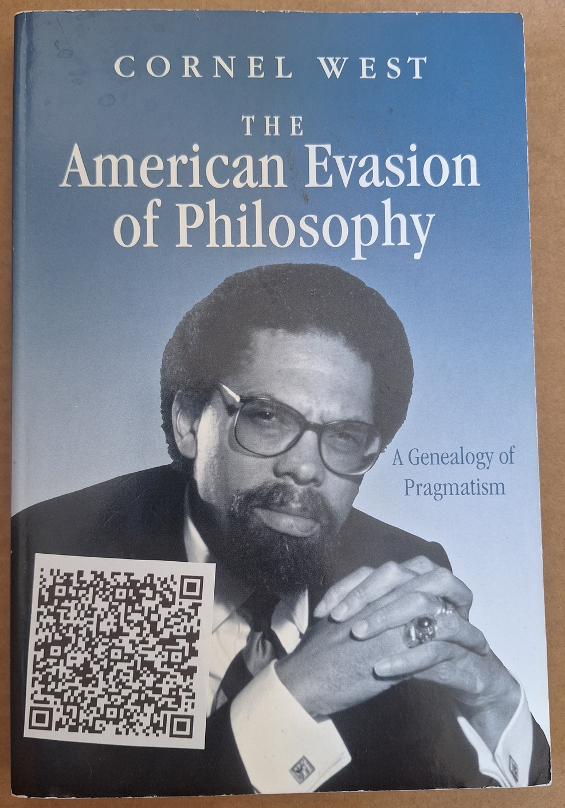
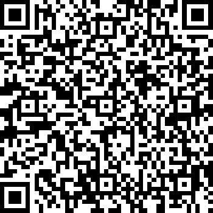

# [The American evasion of philosophy : a genealogy of pragmatism](https://github.com/LafeLabs/library/tree/main/the-american-evasion-of-philosophy/)

  

# [live Trash Magic Wall for this book](https://trashrobot.net/wall/library/the-american-evasion-of-philosophy/)
  

# [thing.json](thing.json)

```
{
    "url": "https://github.com/LafeLabs/library/tree/main/the-american-evasion-of-philosophy",
    "display": "The American evasion of philosophy : a genealogy of pragmatism",
    "title": "The American evasion of philosophy : a genealogy of pragmatism",
    "author": "Cornel West",
    "location": "Dirt Wizard library",
    "loc call number": "B944.P72 W47 1989 ",
    "worldcat number": "608692468",
    "message": "",
    "notes": "",
    "description": "soft cover book 279 pages, 6\" x 9\" x 0.625\"",
    "condition": "good",
    "publisher": "University of Wisconsin press",
    "isbn": " 9780299119638, 9781282697478, 9786612697470, 0299119637, 1282697471, 6612697474",
    "dewey decimal call number": "",
    "contact": "",
    "subjects": "Geschichte History PHILOSOPHY Movements Pragmatism Philosophie Philosophie américaine Histoire Philosophy, American Philosophy, American History Pragmatisches Denken Pragmatism Pragmatism History Pragmatisme Pragmatisme Histoire Pragmatismus USA",
    "keywords": "",
    "length": "279 pages",
    "index": "book 1",
    "summary": "\"Taking Emerson as his starting point, Cornel West's basic task in this ambitious enterprise is to chart the emergence, development, decline, and recent resurgence of American pragmatism. John Dewey is the central figure in West's pantheon of pragmatists, but he treats as well such varied mid-century representatives of the tradition as Sidney Hook, C. Wright Mills, W. E. B. Du Bois, Reinhold Niebuhr, and Lionel Trilling. West's \"genealogy\" is, ultimately, a very personal work, for it is imbued throughout with the author's conviction that a thorough reexamination of American pragmatism may help inspire and instruct contemporary efforts to remake and reform American society and culture.\"",
    "contents": "1. The Emersonian prehistory of American pragmatism. Emerson on power (and tradition) ; Emerson on provocation (and the market) ; Emerson on personality (and race) ; Emerson as organic intellectual 2. The historic emergence of American pragmatism. Peirce on scientific method, community, and Christian love ; James on individuality, reconciliation, and heroic energies 3. The coming-of-age of American pragmatism: John Dewey. Dewey on historical consciousness, critical intelligence, and creative democracy 4. The dilemma of the mid-century pragmatic intellectual. Sidney Hook: the Deweyan political intellectual ; C. Wright Mills: the neo-Deweyan radical social critic ; W.E.B. Du Bois: the Jamesian organic intellectual ; Reinhold Niebuhr: the Jamesian cultural critic ; Lionel Trilling: the pragmatist as Arnoldian literary critic ; The decline and resurgence of American pragmatism: W.V. Quine and Richard Rorty 5. Prophetic pragmatism: cultural criticism and political engagement. Roberto Unger and Third-Wave Left romanticism ; The challenge of Michel Foucault ; Tragedy, tradition, and political praxis ; Prophetic pragmatism and postmodernity"
}
```
