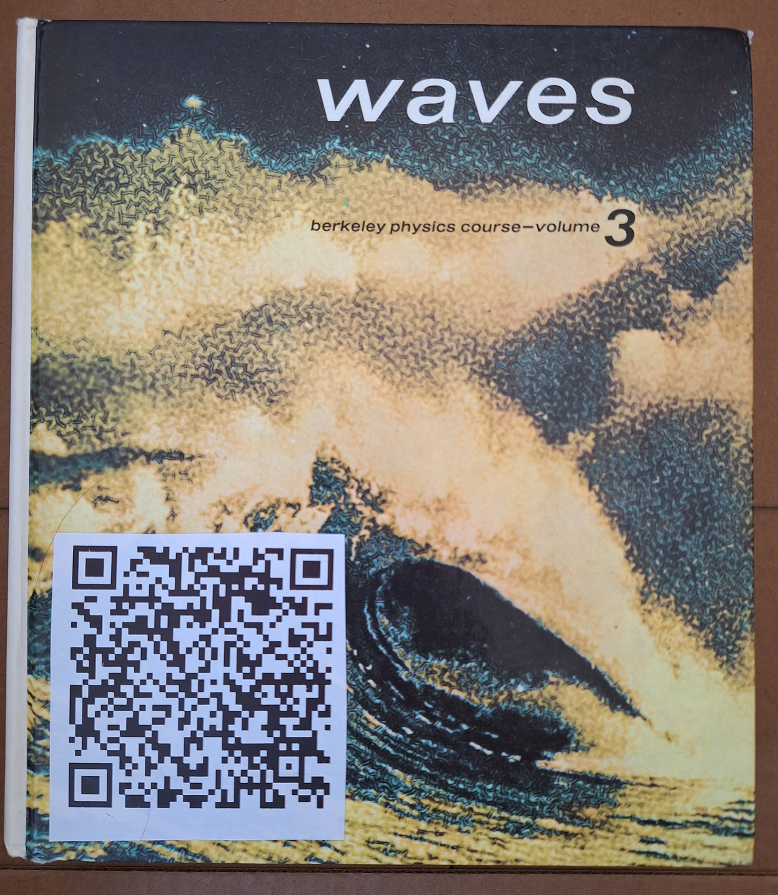
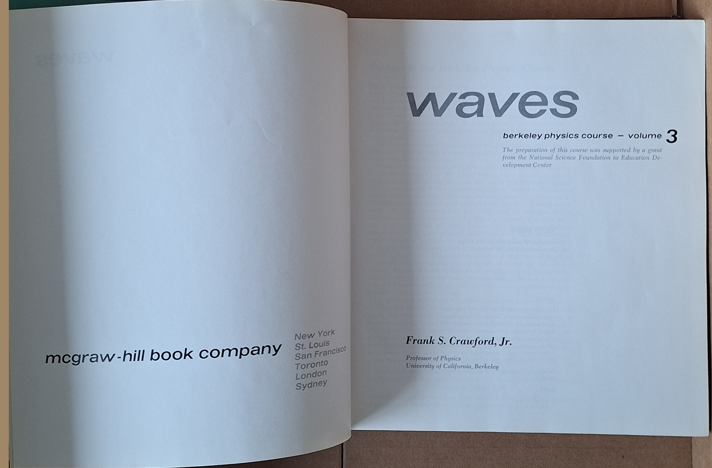
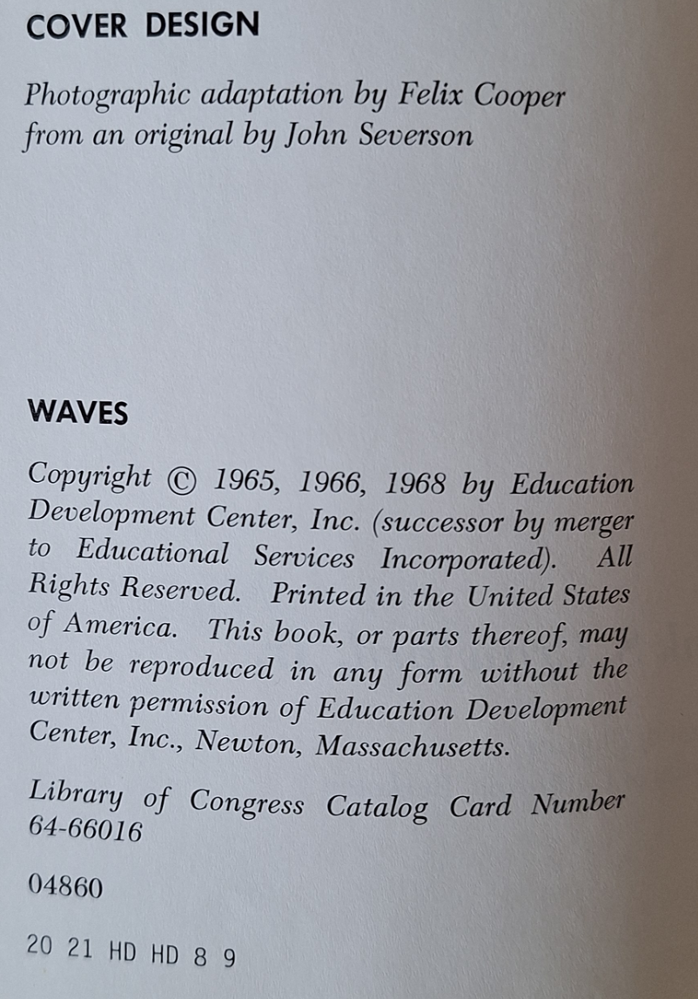
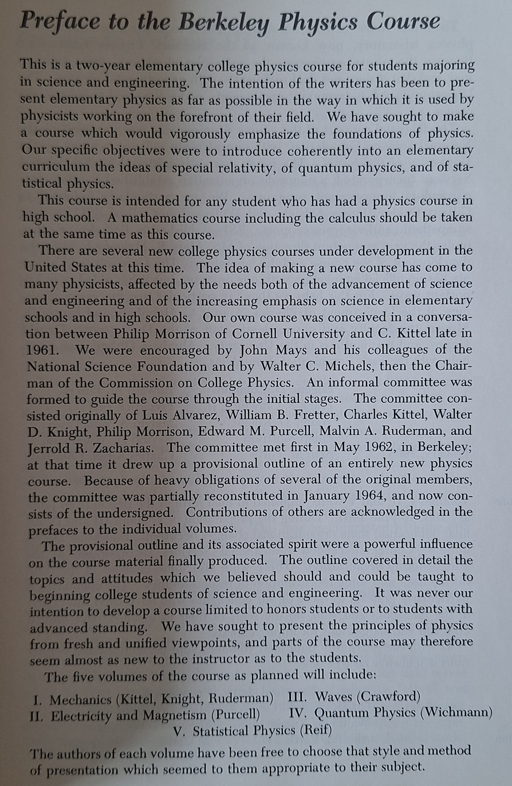
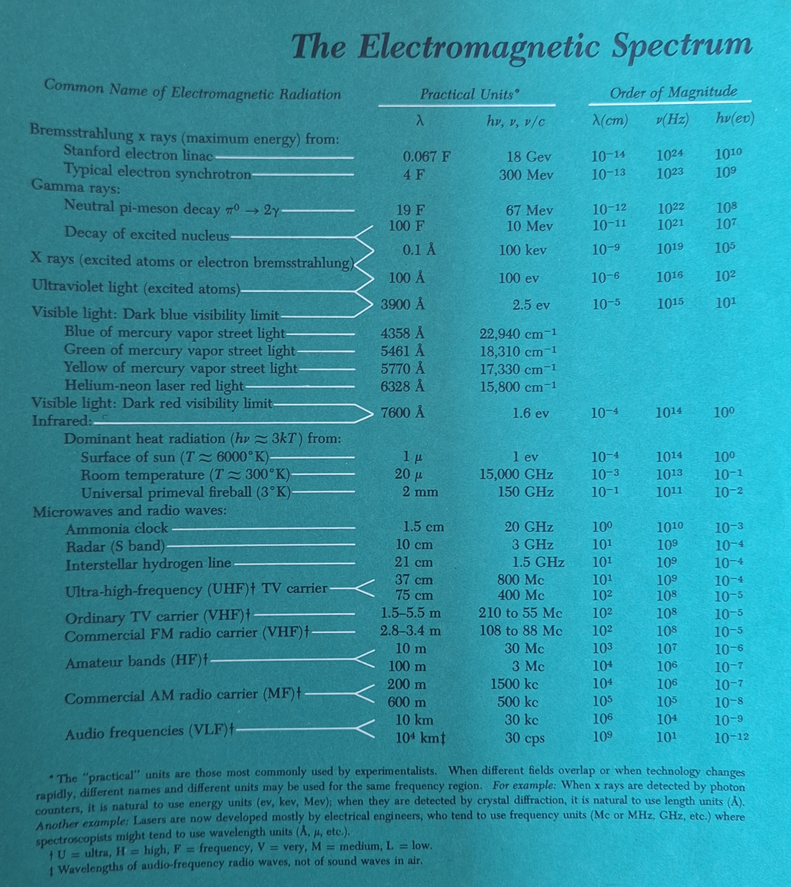
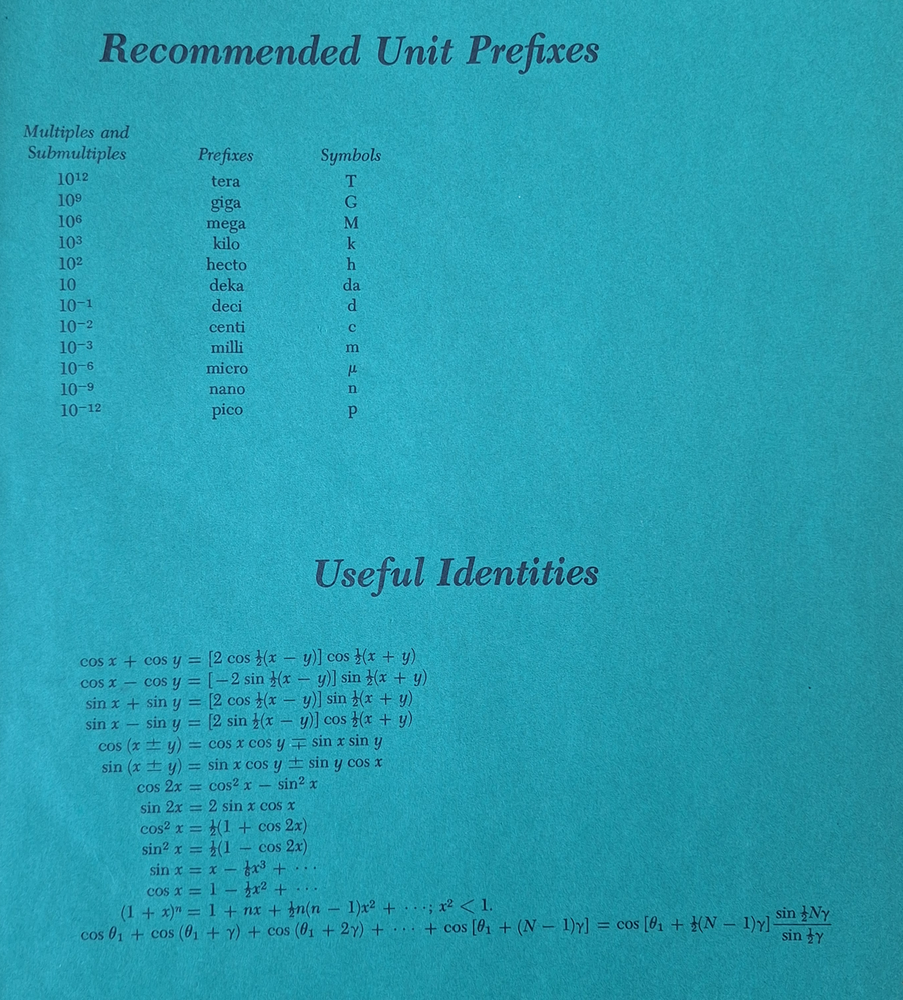
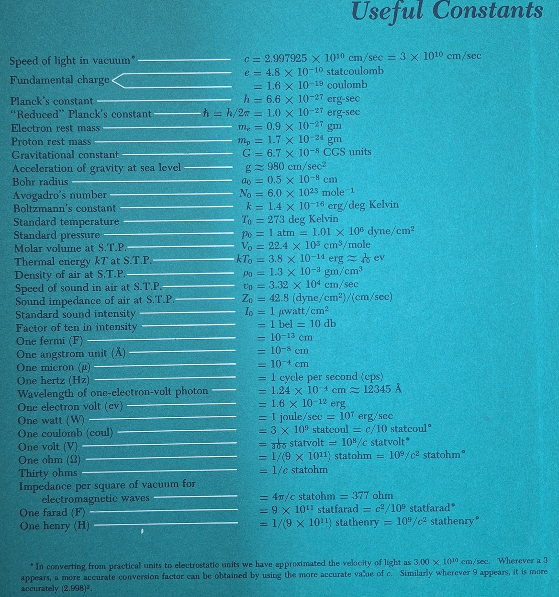

# [waves](https://github.com/lafelabs/library/)
# [index.html](index.html)
# [thing.json](thing.json)

  
  
  
# Berkeley Physics Course Volume 3: Waves

## [Live Trash Magic wall for the book](https://trashrobot.net/wall/library/waves/index.html)
    

```
{
    "url": "https://github.com/LafeLabs/library/tree/main/waves",
    "display": "Waves: Berkeley Physics Course Volume 3",
    "title": "Waves: Berkeley Physics Course Volume 3",
    "author": "Frank S. Crawford, Jr.",
    "location": "Dirt Wizard trash magic library",
    "loc call number": "QC157 .C73 1968 ",
    "worldcat number": "720110",
    "message": "to borrow, contact the dirt wizard on mastodon at cyberpunk.lol/@dirtwizard666 ",
    "notes": "https://trashrobot.net/wall/library/waves/index.html is the wall for this book",
    "description": "The Berkeley physics course is iconic!  This is a whole text book just on wave phenomena! ",
    "condition": "decent",
    "publisher": " McGraw-Hill, New York, [©1968]",
    "isbn": "978-0070048607",
    "dewey decimal call number": "",
    "contact": "",
    "subjects": "",
    "keywords": "waves, physics, textbook, berkeley",
    "length": "599",
    "index": "book 4",
    "date": "1968",
    "physical description": "xviii, 600 pages illustrations 25 cm",
    "contents": ""
}
```









## Library Replication instructions:

1. Install [XAMPP](https://www.apachefriends.org/) on your computer
2. If you don't have one, get a [Github](github.com/) account and sign into it
3. If you don't already use [git](https://en.wikipedia.org/wiki/Git), install [Github Desktop](https://desktop.github.com/download/) to make it easy to use, and log into your Github account in Github Desktop
4. Click the link on this repository to clone it to your local computer, and set the folder that the repository will be cloned into to "/xampp/htdocs/"
5. Open XAMPP on your machine and click the radio button to turn the Apache server on. You only need to click the one radio button, the one for Apache.
6. Go to the link at [http://localhost/library/](http://localhost/library/) to see the live instance of the thing.json file, or go to the live README instance at [http://localhost/lab-notebook-number-three/readme.html](http://localhost/library/readme.html)


Now you have cloned the repository for this physical object. To create your own object in the physical world, you will want to make your own object that changes all the data. 

## Creating a New Thing:

1. Think of a name which clearly identifies the new thing as simply as possible, and construct a name that is all lowercase letters with hyphens, such as my-water-bottle or journal-number-5.  The name only needs to be clear in the context of its creator. So if you have a single collection of journals, a name like journal-number-5 is specific enough in the context of being in your collection. Avoid spaces, and follow the rules for creating well formed URLs.
2. Create a new Github repository with that name
3. Clone to your local drive as per the previous instructions
4. Copy and paste all the visible files from the original repository to the new repository
5. Navigate your browser to "http://localhost/[name-of-repo-here]", e.g. http://localhost/journal-number-5
6. Edit the data in thing.json using index.html and push your new verison to Github using Github Desktop
7. Change the QR code to be your specific one, save it, put it on the object 
8. Enter repository into any relevant databases of things to make it searcheable
